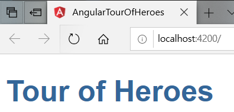

190412_TIL
------------

* Node.js에서 cluster 모듈을 통해 worker를 직접 만들어보고 동작하는 원리를 익힘
* 함수형 프로그래밍에선 왜 느긋한 연산을 해야하는지 _.chain, _()의 차이를 알게 됨.
* Angular의 The Application Shell-Tour of Heroes의 부분 완료

* 실전코딩 수업을 들으면서 Spring에 대한 공부를 시작 => DI, IOC가 Spring에서 대략적으로 어떻게 활용되는지 이해 

>> 오늘은 개인적으로 진행한 부분이 부족했던 거 같다, 내일 코테 보고 바로 빡시게 공부 다시 시작해야지 ㅠㅠㅠㅠㅠ

