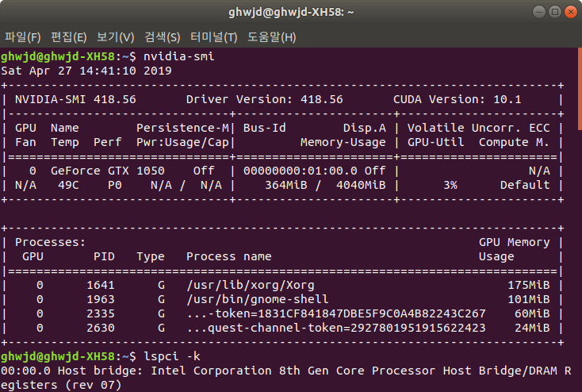

190427_TIL
------------

* Node.js - 크 God Google.. => 삭제 후 남아있는 의존성 문제 때문에 해결이 힘들었다 ㅠㅠ
    * 2019-Node.js repo에 관련 자료 올려둠 후 => 아 설치가 너무 오래걸렸네 
* 함수형 프로그래밍 - 함수 조합기를 사용한 합성 => 매우 흥미로운 내용, 람다JS에서 주어진 유틸리티들을 활용해서 함수를 작은 덩어리로 나누고 다시 합치는 것
    * 합성의 힘을 알았지만, 남용하면 안 좋다는 것도 깨달았고 아직 에러 처리가 없어서 더욱 불안한 느낌이 있습니다.
    * 일단 함수형 프로그래밍에 익숙해지는 것을 이번 학기 목표로 합니다.
* 할 일 
    * @Spy를 써서 이번 단위 테스트 과제 작성 
    * 실전 코딩 - Spring을 이용한 DB에 API정보 저장 후 다시 FE로 가져오는 실습도 응용해볼 것
    * 개인 프로젝트 - GatsBy, 대형마트 API
    * 일일코딩 도 넣어야 하는데....

>> 정처기 2과목 컷 ㄷㄷ => 당장 공부해야지 ㅠㅠ 
>> 와... 일단 엔비디아 우분투에 드라이버 성공 설치함!
>> [걍 이거 대로하면 되네](http://taeksfacility.blogspot.com/2015/09/ubuntu-nvidia.html)
>> 아 난 lightdm이 아닌 gdm을 쓰고 있더라...

>> 
