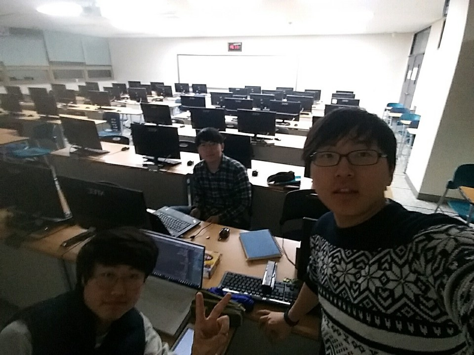

190429_TIL
------------

* Node.js - CRUD를 공부해서 SELECT, UPDATE, DELETE, CREATE를 리눅스에서 MySQL를 조작해서 DB를 구현해봄 
* 함수형 프로그래밍 - 함수자를 배움 -> try-catch를 대체할 새로운 컨테이너 방식의 구현 
* 단위 테스트 - 현재 SPY까지 사용해 테스트 2개 작성 완료 -> 바로 추가하자. 

* API 사용한 Spring 구현 - 강사님 제출 완료가 올 때까지 대기중(API Register Key는 매일 업데이트 할 것임)
    * => 실전 코딩 - Spring을 이용한 DB에 API정보 저장 후 다시 FE로 가져오는 실습도 응용해볼 것 => 좀만 더 기다리자.

* 졸프 모임 - C# Script를 이용한 Object 생성 및 파일 쓰기 -> 이거 성공했음 => 리눅스에서 유니티 설치해서 적용함
    * C# -> StreamWriter or ReadTextLines를 활용해 오브젝트를 텍스트 파일 형식으로 생성 및 불러오기 가능 

* 할 일 
    * 개인 프로젝트 - GatsBy, 대형마트 API
    * 일일코딩 도 넣어야 하는데....
    * 네이버 Data 과학 수업도 들어보자(한다 해놓고 하나도 안 들었네 ㅠㅠ)
    * 부스트코스, 생활 코딩
    * Javascript 공부!

>> 오늘은 제출 기한 맞추고 항상 같이 공부하는 친구들에게 감사!!

>> 음 할 일을 좀 줄일까 ㅠ -> 더 시간을 쪼개보자
